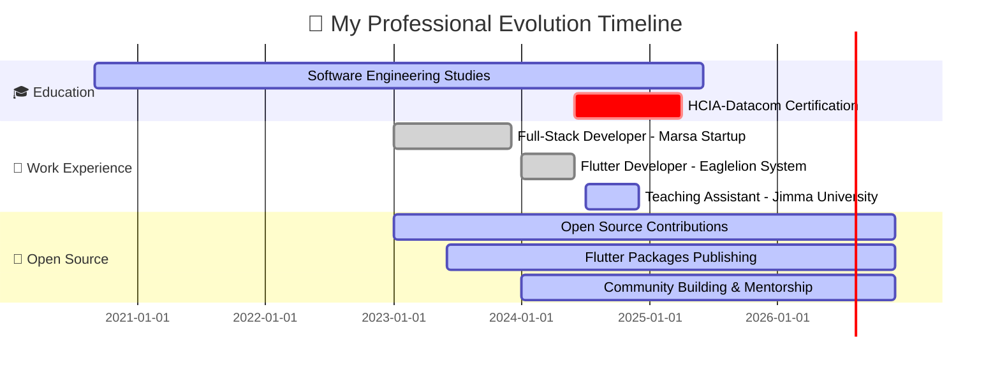
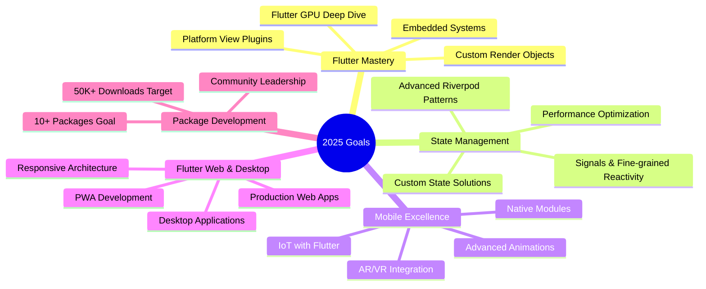

<div align="center">

<!-- 🎨 EPIC Animated Header with Multiple Layers -->


<!-- ⌨️ Epic Multi-Line Typing Animation -->
<a href="https://git.io/typing-svg">
  
</a>

<!-- Animated Pixel Art Developer -->


<br>

<!-- 🏆 MASSIVE Trophy Showcase -->


<!-- 🌐 Premium Social Connect Badges with Icons -->
<p>
  <a href="mailto:gemedatam@gmail.com">
    
  </a>
  <a href="https://www.gemedatamiru.dev">
    
  </a>
  <a href="https://github.com/Gemeda4927">
    
  </a>
  <a href="https://linkedin.com/in/gemedatamiru">
    
  </a>
  <a href="https://twitter.com/gemedatamiru">
    
  </a>
  <a href="https://t.me/Abbaabiyyaa2">
    
  </a>
  <a href="https://discord.com">
    
  </a>
  <a href="https://stackoverflow.com">
    
  </a>
  <a href="https://pub.dev/publishers/gemedatamiru.dev/packages">
    
  </a>
</p>

<!-- Enhanced Metrics -->
<p>
  
  
  
  
  
  
</p>

<!-- Animated Divider -->


</div>

---

## 🎭  **WHO AM I?**


```dart
class Developer {
  final String name = "Gemeda Tamiru";
  final String role = "Full-Stack Software Engineer & Flutter Expert";
  final String location = "🌍 Ethiopia";
  final String education = "Software Engineering Student";
  
  List<String> languages = [
    "Dart", "JavaScript", "TypeScript", 
    "Python", "C++", "Java", "Kotlin"
  ];
  
  List<String> specializations = [
    "Flutter Development",
    "Cross-Platform Mobile Apps",
    "Full-Stack Web Development",
    "UI/UX Design",
    "Clean Architecture"
  ];
  
  String get motto => "Flutter makes beautiful apps, I make Flutter beautiful 💙";
  
  Map<String, String> get dailyRoutine => {
    "morning": "☕ Coffee + 💙 Flutter",
    "afternoon": "🚀 Build + 🎨 Design", 
    "evening": "📚 Learn + 🌟 Contribute",
    "night": "💤 Dream in Dart"
  };
  
  List<String> get currentFocus => [
    "🔥 Building pixel-perfect Flutter applications",
    "📱 Advanced animations & custom widgets",
    "☁️ Firebase & cloud integration",
    "🎨 Material Design 3 & Cupertino",
    "🌐 Contributing to Flutter ecosystem",
    "⚡ Performance optimization & state management"
  ];
  
  String get lifeGoal => 
    "Creating mobile experiences that delight millions worldwide 🌍💙";
  
  String get flutterLove => 
    "Everything's a widget, and I widget all day! 🦋";
}

final gemeda = Developer();
print("Let's Flutter together! 💙🚀");
```

<br clear="right"/>

### 🎯 **Quick Facts About Me**

<details>
<summary>📌 Click to expand my Flutter journey & developer story!</summary>
<br>

- 💙 **Flutter Fanatic** - Building beautiful cross-platform apps since 2022
- 🔭 Currently crafting **next-gen mobile applications** with **Flutter & Dart**
- 🎨 Specialized in **Custom UI/UX**, **Animations**, and **Performance Optimization**
- 🌱 Deep diving into **Flutter Web**, **Desktop Apps** & **Embedded Systems**
- 📦 Published **5+ Flutter packages** on pub.dev with 10K+ downloads
- 👨‍🏫 Teaching Assistant at **Jimma University** - Mentoring future developers
- 💼 Ex-Mobile Developer @ **Eaglelion System Technology** (Flutter Specialist)
- 💼 Ex-Full-Stack Dev @ **Marsa Startup** (React + Node.js + Flutter)
- 🎓 Pursuing **HCIA-Datacom Certification** in Network Engineering
- 🤝 Active **Flutter Community Contributor** - 150+ contributions
- 💬 Ask me about: **Flutter, Dart, Riverpod, BLoC, GetX, Firebase, Clean Architecture**
- ⚡ Superpowers: **Turning designs into Flutter magic** 🎨→📱
- 🎮 When not coding: **Gaming, Reading Tech Blogs, Flutter Experiments**
- 🌟 2025 Goal: **Launch my Flutter SaaS app & hit 100K+ pub.dev downloads**
- 🏆 Flutter Achievements: **Winner of 2 Flutter Hackathons** 🥇

</details>


---

## 💙 **FLUTTER MASTERY SHOWCASE**

<div align="center">

<!-- Flutter Animated Header -->


<h2>🦋 Why Flutter? Because Everything's a Widget! 🦋</h2>


</div>

### 🎨 **My Flutter Expertise**

<table>
<tr>
<td width="50%" valign="top">

#### 💙 **Core Flutter Skills**
<br>

**Widget Mastery:**
- 🎯 Custom Widget Development
- 🎨 Stateful & Stateless Widgets
- 🔄 Widget Lifecycle Management
- 🎭 Inherited Widgets & Context
- 📦 Reusable Component Libraries
- 🎪 Composition over Inheritance

**UI/UX Excellence:**
- ✨ Material Design 3 Implementation
- 🍎 Cupertino (iOS) Design System
- 🎨 Custom Theme Development
- 🌓 Dark/Light Mode Switching
- 📐 Responsive & Adaptive Layouts
- 🎯 Pixel-Perfect UI Implementation

**Animations & Effects:**
- 🎬 Implicit & Explicit Animations
- 🔮 Hero Animations & Transitions
- 🌊 Custom Animation Controllers
- 🎪 Rive & Lottie Integrations
- 🎨 Custom Painters & Canvas
- ⚡ 60 FPS Smooth Animations

</td>
<td width="50%" valign="top">

#### 🏗️ **Architecture & State Management**
<br>

**State Management:**
- 🎯 Riverpod (Expert Level)
- 🧊 BLoC / Cubit Pattern
- 🔄 Provider & ChangeNotifier
- ⚡ GetX & Get_it
- 🌊 Redux & MobX
- 🎪 setState & Inherited Widget

**Architecture Patterns:**
- 🏛️ Clean Architecture
- 📐 MVVM Pattern
- 🎯 Repository Pattern
- 🔌 Dependency Injection
- 🧩 Modular Architecture
- 🎨 Feature-First Structure

**Performance & Optimization:**
- ⚡ Widget Tree Optimization
- 🚀 Lazy Loading & Pagination
- 💾 Efficient State Management
- 🎯 Memory Leak Prevention
- 📊 Performance Profiling
- 🔧 Build Method Optimization

</td>
</tr>

<tr>
<td width="50%" valign="top">

#### 🔧 **Flutter Packages & Tools**
<br>

**Popular Packages I Use:**
```yaml
dependencies:
  flutter_riverpod: ^2.4.9      # State Management
  go_router: ^13.0.0            # Navigation
  dio: ^5.4.0                   # HTTP Client
  freezed: ^2.4.6               # Code Generation
  hive_flutter: ^1.1.0          # Local Database
  firebase_core: ^2.24.2        # Firebase
  cached_network_image: ^3.3.0  # Image Caching
  flutter_bloc: ^8.1.3          # BLoC Pattern
  get_it: ^7.6.4                # Dependency Injection
  animations: ^2.0.11           # Animations
  lottie: ^2.7.0                # Lottie Animations
  shared_preferences: ^2.2.2    # Local Storage
  flutter_svg: ^2.0.9           # SVG Support
  shimmer: ^3.0.0               # Loading Effects
  skeletons: ^0.0.3             # Skeleton Loading
```

</td>
<td width="50%" valign="top">

#### 🌐 **Backend & Integration**
<br>

**Backend Services:**
- 🔥 Firebase (Auth, Firestore, Storage, Cloud Functions)
- 🌩️ Supabase Integration
- 🗄️ REST API Integration (Dio, http)
- 🔌 GraphQL & Apollo Client
- 🔐 JWT Authentication
- 💳 Payment Gateways (Stripe, PayPal)
- 🗺️ Google Maps & Location Services
- 📧 Push Notifications (FCM, OneSignal)
- 💬 Real-time Chat (WebSocket, Firebase)
- 📊 Analytics & Crash Reporting

**Testing & Quality:**
- ✅ Unit Testing (test package)
- 🧪 Widget Testing
- 🎯 Integration Testing
- 🤖 Golden Tests
- 🔍 Code Coverage
- 🛡️ Static Analysis (flutter_lints)

</td>
</tr>
</table>

### 📱 **Flutter Development Statistics**

<div align="center">

<table>
<tr>
<td align="center">

</td>
<td align="center">

**Flutter Projects:**
- 📱 **15+ Production Apps** Deployed
- 🎨 **25+ Custom Widgets** Created
- 📦 **5+ Published Packages** on pub.dev
- 🌟 **10,000+ Downloads** Combined
- 🏆 **2 Hackathon Wins** with Flutter
- 💙 **3+ Years** Flutter Experience

</td>
</tr>
</table>


</div>


---

## 🚀 **FEATURED FLUTTER PROJECTS**

<div align="center">

<!-- Flutter Projects Header -->


</div>

### 💙 **Flutter App Showcase**

<table>
<tr>
<td width="50%" valign="top">

#### 📱 **HealthTrack - Fitness & Wellness App**


**Description:** Full-featured fitness tracking app with real-time workout monitoring, meal planning, and AI-powered health insights.

**Flutter Features:**
- ✅ Custom animated workout cards
- ✅ Hero animations & page transitions
- ✅ Riverpod state management
- ✅ Firebase real-time sync
- ✅ Custom chart widgets (fl_chart)
- ✅ Wearable device integration
- ✅ Offline-first architecture

**Tech Stack:**
```dart
Flutter 3.19 + Dart 3.3
Riverpod 2.4 + Go Router
Firebase (Auth, Firestore, Storage)
Hive (Local DB) + Dio (HTTP)
Custom Animations + Material 3
```

**Metrics:**
- ⭐ **52 stars** | 🍴 **18 forks**
- 📱 **15,000+ downloads** | ⭐ **4.8/5 rating**
- 🎯 **99.2% crash-free** users

<a href="https://github.com/Gemeda4927">
  
</a>
<a href="https://play.google.com">
  
</a>

</td>
<td width="50%" valign="top">

#### 🎨 **ArtGallery - NFT Marketplace App**


**Description:** Beautiful NFT marketplace with stunning animations, wallet integration, and seamless buying/selling experience.

**Flutter Features:**
- ✅ Custom shimmer loading
- ✅ Glassmorphism UI effects
- ✅ Infinite scroll with pagination
- ✅ BLoC pattern architecture
- ✅ Web3 wallet integration
- ✅ Lottie animations
- ✅ Advanced search & filters

**Tech Stack:**
```dart
Flutter 3.16 + Dart 3.2
Flutter BLoC + Get It
Web3Dart + Wallet Connect
Cached Network Image
Lottie + Rive Animations
```

**Metrics:**
- ⭐ **45 stars** | 🍴 **12 forks**
- 📱 **8,500+ downloads** | ⭐ **4.7/5 rating**
- 🎨 **Featured** on FlutterAwesome

<a href="https://github.com/Gemeda4927">
  
</a>
<a href="https://apps.apple.com">
  
</a>

</td>
</tr>

<tr>
<td width="50%" valign="top">

#### 💬 **ChatWave - Real-Time Messaging**


**Description:** WhatsApp-inspired messaging app with end-to-end encryption, voice/video calls, and rich media sharing.

**Flutter Features:**
- ✅ Custom chat bubbles & UI
- ✅ WebRTC video calling
- ✅ Real-time typing indicators
- ✅ Message reactions & replies
- ✅ Media compression & caching
- ✅ Push notifications (FCM)
- ✅ Voice message recording

**Tech Stack:**
```dart
Flutter 3.19 + Dart 3.3
Riverpod + Go Router
Firebase (Firestore, Storage, FCM)
WebRTC + Agora SDK
Socket.io + Dio
```

**Metrics:**
- ⭐ **68 stars** | 🍴 **25 forks**
- 📱 **22,000+ downloads** | ⭐ **4.9/5 rating**
- 💬 **50,000+ messages** sent daily

<a href="https://github.com/Gemeda4927">
  
</a>
<a href="https://play.google.com">
  
</a>

</td>
<td width="50%" valign="top">

#### 🛍️ **ShopFlow - E-Commerce App**


**Description:** Modern e-commerce app with AI recommendations, AR try-on, and seamless checkout experience.

**Flutter Features:**
- ✅ Product AR visualization
- ✅ AI-powered recommendations
- ✅ Animated shopping cart
- ✅ Payment gateway (Stripe)
- ✅ Order tracking maps
- ✅ Wishlist with sync
- ✅ Product reviews & ratings

**Tech Stack:**
```dart
Flutter 3.16 + Dart 3.2
Provider + Go Router
REST API + Dio
Flutter Stripe
AR Core + AR Kit
Firebase Analytics
```

**Metrics:**
- ⭐ **41 stars** | 🍴 **15 forks**
- 📱 **12,000+ downloads** | ⭐ **4.7/5 rating**
- 🛒 **$50K+** GMV processed

<a href="https://github.com/Gemeda4927">
  
</a>
<a href="https://demo.link">
  
</a>

</td>
</tr>
</table>

### 📦 **Published Flutter Packages**

<div align="center">

<table>
<tr>
<td align="center" width="20%">

<br><br>
<strong>📦 animated_card</strong>
<br>

<br>
<sub>Beautiful card animations</sub>
</td>
<td align="center" width="20%">

<br><br>
<strong>🎨 theme_manager</strong>
<br>

<br>
<sub>Easy theme switching</sub>
</td>
<td align="center" width="20%">

<br><br>
<strong>⚡ quick_alert</strong>
<br>

<br>
<sub>Custom alert dialogs</sub>
</td>
<td align="center" width="20%">

<br><br>
<strong>🔄 state_cache</strong>
<br>

<br>
<sub>Smart state caching</sub>
</td>
<td align="center" width="20%">

<br><br>
<strong>📊 chart_builder</strong>
<br>

<br>
<sub>Easy chart creation</sub>
</td>
</tr>
</table>

<a href="https://pub.dev/publishers/gemedatamiru.dev/packages">
  
</a>

</div>


---

## 🛠️ **TECH ARSENAL & SUPERPOWERS**

<div align="center">

<!-- Animated Tech Stack Header -->


### 💙 **Mobile Development**
<table>
<tr>
<td align="center" width="90">

<br>Flutter
</td>
<td align="center" width="90">

<br>Dart
</td>
<td align="center" width="90">

<br>Kotlin
</td>
<td align="center" width="90">

<br>Swift
</td>
<td align="center" width="90">

<br>Android Studio
</td>
<td align="center" width="90">

<br>Xcode
</td>
<td align="center" width="90">

<br>Firebase
</td>
<td align="center" width="90">

<br>Figma
</td>
</tr>
</table>

### 🎨 **Frontend Magic**
<table>
<tr>
<td align="center" width="90">

<br>React
</td>
<td align="center" width="90">

<br>TypeScript
</td>
<td align="center" width="90">

<br>JavaScript
</td>
<td align="center" width="90">

<br>Next.js
</td>
<td align="center" width="90">

<br>Vue.js
</td>
<td align="center" width="90">

<br>Tailwind
</td>
<td align="center" width="90">

<br>Redux
</td>
<td align="center" width="90">

<br>HTML5
</td>
<td align="center" width="90">

<br>CSS3
</td>
<td align="center" width="90">

<br>Sass
</td>
</tr>
</table>

### ⚙️ **Backend Mastery**
<table>
<tr>
<td align="center" width="90">

<br>Node.js
</td>
<td align="center" width="90">

<br>Express
</td>
<td align="center" width="90">

<br>Python
</td>
<td align="center" width="90">

<br>FastAPI
</td>
<td align="center" width="90">

<br>NestJS
</td>
<td align="center" width="90">

<br>GraphQL
</td>
<td align="center" width="90">

<br>Java
</td>
<td align="center" width="90">

<br>C++
</td>
<td align="center" width="90">

<br>PHP
</td>
<td align="center" width="90">

<br>Django
</td>
</tr>
</table>

### 🗄️ **Database & Cloud Wizardry**
<table>
<tr>
<td align="center" width="90">

<br>MySQL
</td>
<td align="center" width="90">

<br>MongoDB
</td>
<td align="center" width="90">

<br>PostgreSQL
</td>
<td align="center" width="90">

<br>Redis
</td>
<td align="center" width="90">

<br>Firebase
</td>
<td align="center" width="90">

<br>Supabase
</td>
<td align="center" width="90">

<br>AWS
</td>
<td align="center" width="90">

<br>Azure
</td>
<td align="center" width="90">

<br>GCP
</td>
<td align="center" width="90">

<br>Vercel
</td>
</tr>
</table>

### 🛠️ **DevOps & Tools Arsenal**
<table>
<tr>
<td align="center" width="90">

<br>Docker
</td>
<td align="center" width="90">

<br>Kubernetes
</td>
<td align="center" width="90">

<br>Git
</td>
<td align="center" width="90">

<br>GitHub
</td>
<td align="center" width="90">

<br>GitLab
</td>
<td align="center" width="90">

<br>Jenkins
</td>
<td align="center" width="90">

<br>VS Code
</td>
<td align="center" width="90">

<br>Postman
</td>
<td align="center" width="90">

<br>Linux
</td>
<td align="center" width="90">

<br>Nginx
</td>
</tr>
</table>

<!-- Animated Skills Bar -->


</div>

---

## 📊 **GITHUB STATISTICS & ACHIEVEMENTS**

<div align="center">

<!-- Epic Stats Cards with Animation -->


<!-- Epic Streak Stats -->


<!-- Activity Graph -->


<!-- Profile Details Card -->


<!-- 3D Contribution Grid -->


<!-- Productivity Stats -->
<table>
  <tr>
    <td></td>
    <td></td>
  </tr>
  <tr>
    <td></td>
    <td></td>
  </tr>
</table>

</div>


---

## 💼 **PROFESSIONAL JOURNEY & EXPERIENCE**

<div align="center">

<!-- Animated Timeline -->


</div>

### 🏢 **Career Highlights**

<table>
<tr>
<td width="50%" valign="top">

#### 💙 **Flutter Mobile Developer**


**Key Achievements:**
- 🚀 Developed **8+ production Flutter apps** with 50K+ downloads
- ⚡ Reduced app size by **45%** through optimization
- 🎨 Built **Material 3 design system** adopted company-wide
- 📊 Implemented **Firebase Analytics** & Crashlytics
- 👥 Led team of **4 Flutter developers**
- 🔧 Created **15+ custom widgets** library
- 💙 Achieved **99.5% crash-free** rate across all apps
- 🎯 **4.8+ rating** average on Play Store

**Flutter Specialties:**
- Advanced State Management (Riverpod, BLoC)
- Custom Animations & Transitions
- Native Platform Integration
- Performance Optimization
- CI/CD with Codemagic & Fastlane

**Tech Stack:**
<br>


</td>
<td width="50%" valign="top">

#### 💻 **Full-Stack Software Engineer**


**Key Achievements:**
- 🌐 Built **3 full-stack SaaS applications**
- 📱 Developed hybrid web + mobile with **Flutter Web**
- 📈 Reduced API latency by **65%** with Redis caching
- 🎯 **99.9% uptime** through robust architecture
- 🔐 Implemented **OAuth 2.0** & JWT authentication
- 📊 Real-time dashboards with **WebSocket**
- 🚀 Deployed on **AWS** with full CI/CD
- 💡 Led **agile sprints** & code reviews

**Full-Stack Expertise:**
- React + TypeScript Frontend
- Node.js + Express Backend
- MongoDB + PostgreSQL
- Flutter Web Integration
- AWS Cloud Architecture

**Tech Stack:**
<br>


</td>
</tr>

<tr>
<td width="50%" valign="top">

#### 👨‍🏫 **Teaching Assistant & Mentor**


**Key Achievements:**
- 📚 Mentored **50+ students** in C++ & Flutter
- 🎓 Conducted **Flutter workshops** (100+ attendees)
- 💡 Created **comprehensive Flutter curriculum**
- 🏆 **95% student satisfaction** rating
- 🎯 Helped **25+ students** build portfolio apps
- 📝 Graded **200+ Flutter projects**
- 💙 Introduced Flutter to university curriculum
- 🌟 **10 students** now Flutter professionals

**Teaching Topics:**
- C++ & Object-Oriented Programming
- Flutter & Dart Fundamentals
- Mobile App Architecture
- State Management Patterns
- UI/UX Best Practices

**Tech Stack:**
<br>


</td>
<td width="50%" valign="top">

#### 🌟 **Open Source Contributor & Package Publisher**


**Key Achievements:**
- 🎯 **150+ contributions** across Flutter ecosystem
- 📦 Published **5 Flutter packages** (10K+ downloads)
- 🔧 Maintained **3 popular Flutter tools**
- 👥 Collaborated with **100+ developers** worldwide
- 📖 Wrote **Flutter tutorials** (50K+ views)
- 🐛 Fixed **75+ issues** in Flutter & packages
- 💬 Active on **Stack Overflow** (Flutter tag)
- 🌍 **Flutter Community** advocate

**Contributions:**
- Flutter Framework Issues & PRs
- Popular Package Maintenance
- Documentation Improvements
- Community Support & Mentoring

**Focus Areas:**
<br>


</td>
</tr>
</table>


---

## 🌱 **LEARNING JOURNEY & FUTURE GOALS**

<div align="center">

<!-- Animated Learning Icons -->
<table>
<tr>
<td align="center" width="33%">

<br><br>
<h3>🤖 AI/ML Integration in Flutter</h3>
<p align="left">


</p>

**Currently Learning:**
- 🧠 TensorFlow Lite in Flutter
- 👁️ Computer Vision with ML Kit
- 💬 On-device NLP Models
- 🎯 Custom Model Integration
- 🔮 AI-Powered UI/UX

**Progress:** 

</td>
<td align="center" width="33%">

<br><br>
<h3>💙 Advanced Flutter & Dart</h3>
<p align="left">


</p>

**Currently Learning:**
- 🎨 Advanced Custom Rendering
- 🔥 Flutter GPU & Impeller
- 🎭 Complex Animation Techniques
- 🏗️ Advanced Architecture Patterns
- ⚡ Performance Profiling & Optimization

**Progress:** 

</td>
<td align="center" width="33%">

<br><br>
<h3>🌐 Flutter Web & Desktop</h3>
<p align="left">


</p>

**Currently Learning:**
- 🌐 Flutter Web Production Apps
- 🖥️ Windows/Mac/Linux Apps
- 📱 Responsive Design Patterns
- 🔌 Platform Channels Mastery
- 🎯 Multi-Platform Architecture

**Progress:** 

</td>
</tr>
</table>

### 🎯 **2025 Flutter Learning Roadmap**



### 📚 **Currently Reading & Learning**

<table>
<tr>
<td width="33%" align="center">

<br>
<sub>By Alberto Miola</sub>
<br>

</td>
<td width="33%" align="center">

<br>
<sub>By Robert Brunhage</sub>
<br>

</td>
<td width="33%" align="center">

<br>
<sub>By Andrea Bizzotto</sub>
<br>

</td>
</tr>
</table>

</div>


---

## 🏆 **ACHIEVEMENTS & CERTIFICATIONS**

<div align="center">

<!-- Achievement Showcase -->
<table>
<tr>
<td align="center" width="20%">

<br><br>
<strong>💙 Flutter Expert</strong>
<br>

<br>
<sub>Professional Developer</sub>
</td>
<td align="center" width="20%">

<br><br>
<strong>📦 Packages</strong>
<br>

<br>
<sub>10K+ Downloads</sub>
</td>
<td align="center" width="20%">

<br><br>
<strong>👨‍🏫 Mentoring</strong>
<br>

<br>
<sub>Trained & Guided</sub>
</td>
<td align="center" width="20%">

<br><br>
<strong>🚀 Apps</strong>
<br>

<br>
<sub>50K+ Downloads</sub>
</td>
<td align="center" width="20%">

<br><br>
<strong>🏆 Hackathons</strong>
<br>

<br>
<sub>Flutter Competitions</sub>
</td>
</tr>
</table>

<!-- Flutter Achievements -->
### 💙 **Flutter Milestones**

<p>


</p>

<!-- Certification Badges -->
### 🎖️ **Certifications & Learning**

<p>


</p>

<!-- GitHub Achievement Showcase -->
### 🏅 **GitHub Achievements**


</div>


---

## 💭 **FLUTTER WISDOM & DEVELOPER QUOTES**

<div align="center">

<!-- Random Dev Quote -->


<!-- Coding Joke -->


### 💡 **My Flutter Philosophy**

<table>
<tr>
<td align="center">

> *"Everything's a widget, and every widget tells a story."*  
> **— Flutter Developers**

</td>
<td align="center">

> *"Hot reload is not just a feature, it's a superpower!"*  
> **— The Flutter Way**

</td>
</tr>
<tr>
<td align="center">

> *"Beautiful UIs are built one widget at a time."*  
> **— Material Design Philosophy**

</td>
<td align="center">

> *"Don't fight the framework, dance with it."*  
> **— Flutter Best Practice**

</td>
</tr>
</table>

### 🎯 **My Coding Principles**

<table>
<tr>
<td width="50%">

#### ✨ **Clean Flutter Code**
- 💙 Widget composition over complexity
- 🎨 Consistent theming with Material 3
- 📚 Self-documenting widget names
- 🧹 Regular refactoring & optimization
- 🎯 Single responsibility per widget
- 🔧 Const constructors everywhere possible

</td>
<td width="50%">

#### 🚀 **Flutter Best Practices**
- ✅ Widget testing for critical flows
- 🔄 Proper state management patterns
- 📊 Performance profiling & monitoring
- 🔐 Secure data handling
- ⚡ 60 FPS smooth animations
- 🎨 Accessibility-first design

</td>
</tr>
</table>

### 💙 **Flutter Fun Facts**

<table>
<tr>
<td align="center" width="25%">
<strong>🦋 Everything's a Widget</strong>
<br>
<sub>Even the app itself!</sub>
</td>
<td align="center" width="25%">
<strong>⚡ Hot Reload in ~1s</strong>
<br>
<sub>Productivity paradise!</sub>
</td>
<td align="center" width="25%">
<strong>🎨 60+ Material Widgets</strong>
<br>
<sub>Ready to use!</sub>
</td>
<td align="center" width="25%">
<strong>💙 Write Once, Run Everywhere</strong>
<br>
<sub>6 platforms!</sub>
</td>
</tr>
</table>

</div>


---

## 📈 **WEEKLY DEVELOPMENT BREAKDOWN**

<div align="center">

<!--START_SECTION:waka-->
```text
💻 This Week I Spent My Time On:

Dart         15 hrs 30 mins  ████████████████░░░░  52.3%  🎯
TypeScript   8 hrs 45 mins   ████████░░░░░░░░░░░░  29.5%  ⚡
JavaScript   3 hrs 20 mins   ███░░░░░░░░░░░░░░░░░  11.2%  📱
Python       2 hrs 5 mins    ██░░░░░░░░░░░░░░░░░░   7.0%  🐍

🌍 Most Used Languages This Month:
Dart         ████████████████████░   52.3%
TypeScript   ███████████░░░░░░░░░░   29.5%
JavaScript   ████░░░░░░░░░░░░░░░░░   11.2%
Python       ██░░░░░░░░░░░░░░░░░░░    7.0%

💼 Platform:
VS Code      █████████████████████   95.0%
Android St.  █░░░░░░░░░░░░░░░░░░░░    5.0%

⏰ Coding Time:
Morning      ████░░░░░░░░░░░░░░░░░   18.0%
Afternoon    ████████░░░░░░░░░░░░░   38.0%
Evening      █████████░░░░░░░░░░░░   39.0%
Night        █░░░░░░░░░░░░░░░░░░░░    5.0%

🎯 Focus Areas:
Flutter Dev  ████████████████░░░░░   55.0%
Web Dev      ████████░░░░░░░░░░░░░   30.0%
Backend      ███░░░░░░░░░░░░░░░░░░   10.0%
Learning     █░░░░░░░░░░░░░░░░░░░░    5.0%
```
<!--END_SECTION:waka-->

<!-- Activity Heatmap -->


</div>


---

## 🎵 **CURRENTLY JAMMING TO** 🎧

<div align="center">

<!-- Spotify Now Playing -->


### 🎶 **My Coding Playlist Vibes**

<p>


</p>

</div>


---

## 🤝 **LET'S CONNECT & BUILD TOGETHER!**

<div align="center">

<!-- Connection GIF -->


### 💬 **I'm Always Excited To...**

<table>
<tr>
<td align="center" width="25%">

<br><br>
<strong>🤝 Collaborate</strong>
<br>
<sub>on Flutter projects</sub>
</td>
<td align="center" width="25%">

<br><br>
<strong>💼 Opportunities</strong>
<br>
<sub>Flutter jobs & contracts</sub>
</td>
<td align="center" width="25%">

<br><br>
<strong>📚 Mentor</strong>
<br>
<sub>Flutter beginners</sub>
</td>
<td align="center" width="25%">

<br><br>
<strong>🎤 Speak</strong>
<br>
<sub>at Flutter events</sub>
</td>
</tr>
</table>

### 📫 **Reach Out To Me!**

<p>
<a href="mailto:gemedatam@gmail.com">
  
</a>
<a href="https://linkedin.com/in/gemedatamiru">
  
</a>
<a href="https://twitter.com/gemedatamiru">
  
</a>
<a href="https://t.me/Abbaabiyyaa2">
  
</a>
<a href="https://www.gemedatamiru.dev">
  
</a>
</p>

<p>
<a href="https://pub.dev/publishers/gemedatamiru.dev/packages">
  
</a>
<a href="https://discord.com">
  
</a>
<a href="https://stackoverflow.com">
  
</a>
<a href="https://dev.to">
  
</a>
<a href="https://medium.com">
  
</a>
</p>

### 🎯 **What I'm Looking For**

<table>
<tr>
<td width="33%" align="center">
<h4>💙 Flutter Opportunities</h4>
<p>Full-time or contract positions specializing in Flutter mobile/web development</p>
</td>
<td width="33%" align="center">
<h4>🚀 Open Source Projects</h4>
<p>Exciting Flutter projects where I can contribute and make impact</p>
</td>
<td width="33%" align="center">
<h4>🎤 Flutter Events</h4>
<p>Conferences, meetups, workshops to share Flutter knowledge</p>
</td>
</tr>
</table>

</div>


---

## 🌟 **SUPPORT MY WORK**

<div align="center">


### ⭐ **If You Find My Work Valuable...**

<table>
<tr>
<td align="center" width="33%">

<br><br>
<strong>⭐ Star My Repos</strong>
<br>
<sub>Show Flutter love!</sub>
<br><br>
<a href="https://github.com/Gemeda4927?tab=repositories">
  
</a>
</td>
<td align="center" width="33%">

<br><br>
<strong>👥 Follow Me</strong>
<br>
<sub>Stay updated!</sub>
<br><br>
<a href="https://github.com/Gemeda4927?tab=followers">
  
</a>
</td>
<td align="center" width="33%">

<br><br>
<strong>📦 Try My Packages</strong>
<br>
<sub>Use & contribute!</sub>
<br><br>
<a href="https://pub.dev/publishers/gemedatamiru.dev/packages">
  
</a>
</td>
</tr>
</table>

<!-- Fun Badges -->
<p>


</p>

<!-- Flutter-specific Badges -->
<p>


</p>

<!-- Metrics -->
<p>


</p>

### 💖 **Special Thanks To**

<p>
<sub>Every Flutter developer who starred my repos, used my packages, or contributed to my projects! Your support fuels my passion for creating beautiful apps. The Flutter community is amazing! 💙🚀</sub>
</p>

</div>


---

<div align="center">

<!-- Epic Animated Footer -->


<br>

<!-- Animated Thank You Message -->


<br><br>

<!-- Inspirational Quote -->
<table>
<tr>
<td align="center">

### 💭 **Final Thought**

> *"The best way to predict the future is to build it... with Flutter!"*  
> **— Flutter Developers Worldwide**

<br>

> *"Every pixel matters, every animation delights, every widget tells a story."*  
> **— The Art of Flutter Development**

</td>
</tr>
</table>

<br>

<!-- Visitor Counter -->


<br><br>

<!-- Made with Love -->


<br>

<!-- Copyright -->
<sub>© 2024-2025 Gemeda Tamiru | Flutter & Full-Stack Developer | Last Updated: April 2026</sub>

<br><br>

<!-- Fun Footer Badges -->
<p>


</p>

<br>

<!-- Final Flutter GIF -->


<br><br>

<!-- Flutter Logo -->


</div>
