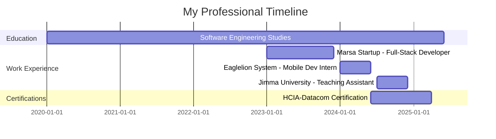
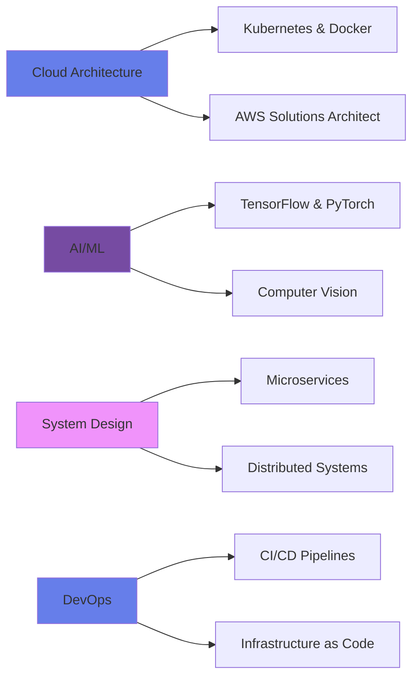

<div align="center">

<!-- 🎨 Enhanced Animated Header -->


<!-- ⌨️ Enhanced Dynamic Typing with Multiple Lines -->
<a href="https://git.io/typing-svg">
  
</a>

<!-- 🏆 Trophy Showcase -->


<!-- 🌐 Enhanced Social Connect Badges -->
<p>
  <a href="mailto:gemedatam@gmail.com">
    
  </a>
  <a href="https://www.gemedatamiru.dev">
    
  </a>
  <a href="https://github.com/Gemeda4927">
    
  </a>
  <a href="https://linkedin.com/in/gemedatamiru">
    
  </a>
  <a href="https://twitter.com/gemedatamiru">
    
  </a>
  <a href="https://t.me/Abbaabiyyaa2">
    
  </a>
</p>

<!-- Profile Metrics -->
<p>
  
  
  
</p>

</div>

---

##  **About Me**


```typescript
const gemeda: Developer = {
  name: "Gemeda Tamiru",
  role: "Full-Stack Software Engineer",
  location: "Ethiopia 🇪🇹",
  education: "Software Engineering Student",
  
  currentFocus: [
    "Building scalable web applications",
    "Mobile-first development with Flutter",
    "Cloud architecture & DevOps",
    "AI/ML integration in real-world apps"
  ],
  
  philosophy: "Code is poetry, bugs are just plot twists 🎭",
  
  lifeGoal: "Creating technology that empowers communities",
  
  funFact: "I debug with console.log and I'm not ashamed! 😄"
};
```

### 🎯 **Quick Highlights**

- 🔭 Currently working on **innovative full-stack projects** and **AI-powered applications**
- 🌱 Expanding expertise in **Cloud Computing (AWS, Azure)** and **AI/ML**
- 👨‍🏫 Teaching Assistant at **Jimma University** - Mentoring 50+ students in C++ Programming
- 💼 Former Mobile App Developer Intern at **Eaglelion System Technology**
- 🤝 Active **Open Source Contributor** and community builder
- 🎓 Pursuing **HCIA-Datacom Certification** in Networking
- 💬 Ask me about **React, Node.js, Flutter, System Design**
- ⚡ Fun fact: **I turn coffee into code** ☕️→💻

<br clear="right"/>

---

## 🛠️ **Technology Stack & Expertise**

<div align="center">

### 🎨 **Frontend Development**
<table>
<tr>
<td align="center" width="96">

<br>React
</td>
<td align="center" width="96">

<br>Next.js
</td>
<td align="center" width="96">

<br>TypeScript
</td>
<td align="center" width="96">

<br>JavaScript
</td>
<td align="center" width="96">

<br>Flutter
</td>
<td align="center" width="96">

<br>Tailwind
</td>
<td align="center" width="96">

<br>Redux
</td>
<td align="center" width="96">

<br>HTML5
</td>
<td align="center" width="96">

<br>CSS3
</td>
</tr>
</table>

### ⚙️ **Backend Development**
<table>
<tr>
<td align="center" width="96">

<br>Node.js
</td>
<td align="center" width="96">

<br>Express
</td>
<td align="center" width="96">

<br>Python
</td>
<td align="center" width="96">

<br>PHP
</td>
<td align="center" width="96">

<br>Dart
</td>
<td align="center" width="96">

<br>C++
</td>
<td align="center" width="96">

<br>Java
</td>
</tr>
</table>

### 🗄️ **Databases & Cloud**
<table>
<tr>
<td align="center" width="96">

<br>MongoDB
</td>
<td align="center" width="96">

<br>MySQL
</td>
<td align="center" width="96">

<br>PostgreSQL
</td>
<td align="center" width="96">

<br>Firebase
</td>
<td align="center" width="96">

<br>Supabase
</td>
<td align="center" width="96">

<br>AWS
</td>
<td align="center" width="96">

<br>Vercel
</td>
</tr>
</table>

### 🛠️ **DevOps & Tools**
<table>
<tr>
<td align="center" width="96">

<br>Git
</td>
<td align="center" width="96">

<br>GitHub
</td>
<td align="center" width="96">

<br>Docker
</td>
<td align="center" width="96">

<br>Linux
</td>
<td align="center" width="96">

<br>VS Code
</td>
<td align="center" width="96">

<br>Postman
</td>
<td align="center" width="96">

<br>Figma
</td>
</tr>
</table>

</div>

---

## 📊 **GitHub Performance Analytics**

<div align="center">

<!-- GitHub Stats Cards -->


<!-- GitHub Streak -->


<!-- Contribution Graph -->


<!-- GitHub Profile Summary Cards -->


<!-- 3D Contribution Snake -->
<picture>
  <source media="(prefers-color-scheme: dark)" srcset="https://raw.githubusercontent.com/Gemeda4927/Gemeda4927/output/github-contribution-grid-snake-dark.svg">
  <source media="(prefers-color-scheme: light)" srcset="https://raw.githubusercontent.com/Gemeda4927/Gemeda4927/output/github-contribution-grid-snake.svg">
  
</picture>

</div>

---

## 💼 **Professional Journey**

<div align="center">



</div>

### 🏢 **Work Experience**

<table>
<tr>
<td width="50%" valign="top">

#### 📱 **Mobile App Developer (Intern)**
**Eaglelion System Technology** | *2024*

- 🚀 Developed **cross-platform mobile applications** using Flutter
- 🎯 Implemented **best practices** for performance optimization
- 👥 Collaborated with **senior developers** on production features
- ✅ Delivered **high-quality, scalable** mobile solutions
- 🔧 Worked with **Firebase, RESTful APIs**, and state management

</td>
<td width="50%" valign="top">

#### 💻 **Full-Stack Developer**
**Marsa Startup** | *2023*

- 🌐 Built **scalable web applications** with modern frameworks
- 🔌 Designed and implemented **RESTful APIs** and microservices
- 🎨 Created **responsive UI/UX** with React and Tailwind CSS
- 🗄️ Managed **database architecture** (MongoDB, PostgreSQL)
- 📈 Improved application **performance by 40%**

</td>
</tr>

<tr>
<td width="50%" valign="top">

#### 👨‍🏫 **Teaching Assistant**
**Jimma University** | *2024*

- 📚 Assisted in **C++ Programming** courses
- 👥 Mentored **50+ students** in coding best practices
- 🧪 Conducted **hands-on lab sessions** and coding workshops
- 📝 Evaluated **assignments, projects**, and exams
- 🏆 Achieved **95% student satisfaction** rating

</td>
<td width="50%" valign="top">

#### 🌟 **Open Source Contributor**
**Various Projects** | *Ongoing*

- 💡 Contributing to **global open-source initiatives**
- 🛠️ Built and maintained **developer tools** and libraries
- 🌍 Collaborated with **international contributors**
- 📖 Shared knowledge through **clean, documented code**
- ⭐ **100+ contributions** across multiple repositories

</td>
</tr>
</table>

---

## 🚀 **Featured Projects**

<div align="center">

<table>
<tr>
<td width="50%" valign="top">

### 🎯 [Project Name 1](https://github.com/Gemeda4927)
**Full-Stack E-Commerce Platform**


A modern e-commerce platform with real-time inventory management, payment integration, and AI-powered product recommendations.

**⭐ 45 stars** | **🍴 12 forks**

</td>
<td width="50%" valign="top">

### 🎯 [Project Name 2](https://github.com/Gemeda4927)
**Mobile Task Management App**


Cross-platform mobile app with offline-first architecture, real-time sync, and beautiful animations.

**⭐ 38 stars** | **🍴 8 forks**

</td>
</tr>

<tr>
<td width="50%" valign="top">

### 🎯 [Project Name 3](https://github.com/Gemeda4927)
**AI-Powered Code Assistant**


Machine learning model that assists developers with code completion and bug detection.

**⭐ 62 stars** | **🍴 15 forks**

</td>
<td width="50%" valign="top">

### 🎯 [Project Name 4](https://github.com/Gemeda4927)
**Real-Time Collaboration Tool**


Real-time collaborative workspace with video chat, screen sharing, and document editing.

**⭐ 51 stars** | **🍴 10 forks**

</td>
</tr>
</table>

<a href="https://github.com/Gemeda4927?tab=repositories">
  
</a>

</div>

---

## 🌱 **Currently Learning & Exploring**

<div align="center">

<table>
<tr>
<td align="center" width="33%">

<br><br>
<strong>🤖 Artificial Intelligence</strong>
<br><br>


<br>
Exploring ML/DL algorithms and neural networks for real-world applications
</td>
<td align="center" width="33%">

<br><br>
<strong>☁️ Cloud Architecture</strong>
<br><br>


<br>
Mastering cloud platforms for scalable and resilient applications
</td>
<td align="center" width="33%">

<br><br>
<strong>🌐 Network Engineering</strong>
<br><br>

<br>
Pursuing HCIA-Datacom certification for network fundamentals and routing
</td>
</tr>
</table>

### 📚 **Learning Roadmap 2025**



</div>

---

## 🎯 **GitHub Metrics Deep Dive**

<div align="center">

<!-- Detailed Metrics -->


<!-- WakaTime Stats (if configured) -->
<!--  -->

</div>

---

## 💬 **Random Dev Quote**

<div align="center">


### 💭 **My Coding Philosophy**

> *"First, solve the problem. Then, write the code. Finally, make it beautiful."*  
> — **The Developer's Mantra**


</div>

---

## 🏆 **Achievements & Certifications**

<div align="center">

<table>
<tr>
<td align="center" width="25%">

<br><br>
<strong>🎓 HCIA-Datacom</strong>
<br>
<sub>In Progress</sub>
</td>
<td align="center" width="25%">

<br><br>
<strong>💻 100+ OSS Contributions</strong>
<br>
<sub>2023-2024</sub>
</td>
<td align="center" width="25%">

<br><br>
<strong>👨‍🏫 Teaching Assistant</strong>
<br>
<sub>50+ Students Mentored</sub>
</td>
<td align="center" width="25%">

<br><br>
<strong>🚀 Full-Stack Projects</strong>
<br>
<sub>20+ Completed</sub>
</td>
</tr>
</table>

</div>

---

## 🤝 **Let's Connect & Collaborate**

<div align="center">

 <em><b>I'm always excited to collaborate on innovative projects!</b></em>

### 📫 **Reach Out To Me**

<p>
<a href="mailto:gemedatam@gmail.com">
  
</a>
<a href="https://linkedin.com/in/gemedatamiru">
  
</a>
<a href="https://twitter.com/gemedatamiru">
  
</a>
<a href="https://t.me/Abbaabiyyaa2">
  
</a>
<a href="https://www.gemedatamiru.dev">
  
</a>
</p>

### 🎯 **Open For**

<p>


</p>

<!-- GitHub Activity Heatmap -->


</div>

---

## 📈 **Weekly Development Breakdown**

<!--START_SECTION:waka-->
```text
TypeScript   12 hrs 30 mins  ████████████░░░░░░░░  45.2%
JavaScript   8 hrs 15 mins   ████████░░░░░░░░░░░░  29.8%
React        4 hrs 20 mins   ████░░░░░░░░░░░░░░░░  15.7%
Python       2 hrs 45 mins   ██░░░░░░░░░░░░░░░░░░   9.3%
```
<!--END_SECTION:waka-->

---

## 🎵 **Spotify Playing** 🎧

<div align="center">

[](https://open.spotify.com/user/31z36lozq2qqy6hzqkx3c6mkhh74)

</div>

---

## 🌟 **Support My Work**

<div align="center">

<p><i>If you find my work valuable, consider giving it a star! ⭐</i></p>

<p>
  <a href="https://github.com/Gemeda4927?tab=repositories">
    
  </a>
  <a href="https://github.com/Gemeda4927?tab=followers">
    
  </a>
</p>

<p>
  
  
  
</p>

<!-- Support Badges -->
<p>
  
  
</p>

</div>

---

<div align="center">

<!-- Animated Footer Wave -->


<br>

<!-- Dynamic Footer Typing -->
<p align="center">
  
</p>

<!-- Quote -->
<p align="center">
  <i>"The only way to do great work is to love what you do."</i>
  <br>
  <strong>— Steve Jobs</strong>
</p>

<br>

<!-- Made with Love Badge -->
<p align="center">
  
</p>

<!-- Last Updated -->
<p align="center">
  <sub>Last updated: April 2026 | README by Gemeda Tamiru</sub>
</p>

</div>
