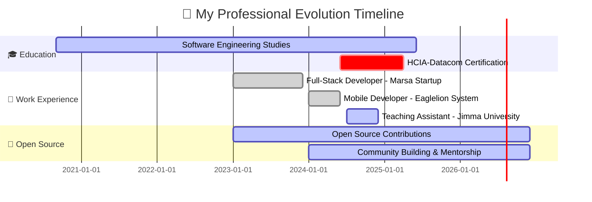
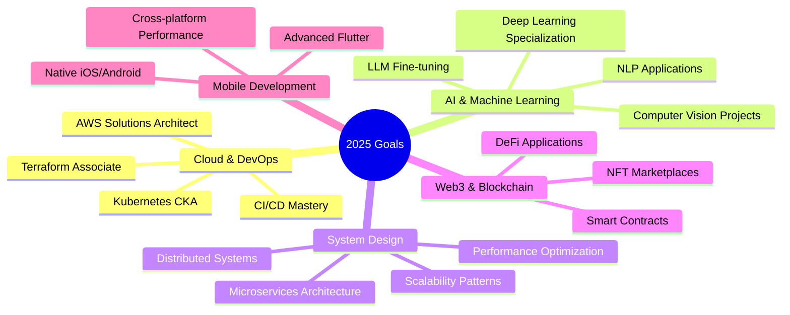

<div align="center">

<!-- 🎨 EPIC Animated Header with Multiple Layers -->


<!-- ⌨️ Epic Multi-Line Typing Animation -->
<a href="https://git.io/typing-svg">
  
</a>

<!-- Animated Pixel Art Developer -->


<br>

<!-- 🏆 MASSIVE Trophy Showcase -->


<!-- 🌐 Premium Social Connect Badges with Icons -->
<p>
  <a href="mailto:gemedatam@gmail.com">
    
  </a>
  <a href="https://www.gemedatamiru.dev">
    
  </a>
  <a href="https://github.com/Gemeda4927">
    
  </a>
  <a href="https://linkedin.com/in/gemedatamiru">
    
  </a>
  <a href="https://twitter.com/gemedatamiru">
    
  </a>
  <a href="https://t.me/Abbaabiyyaa2">
    
  </a>
  <a href="https://discord.com">
    
  </a>
  <a href="https://stackoverflow.com">
    
  </a>
</p>

<!-- Enhanced Metrics -->
<p>
  
  
  
  
  
  
</p>

<!-- Animated Divider -->


</div>

---

## 🎭  **WHO AM I?**


```javascript
class Developer {
  constructor() {
    this.name = "Gemeda Tamiru";
    this.role = "Full-Stack Software Engineer";
    this.location = "🌍 Ethiopia";
    this.education = "Software Engineering Student";
    this.languages = ["JavaScript", "TypeScript", "Python", "Dart", "C++", "Java"];
    this.motto = "Code is poetry, bugs are just plot twists 🎭";
  }

  get dailyRoutine() {
    return {
      morning: "☕ Coffee + 💻 Code",
      afternoon: "🚀 Build + 🐛 Debug", 
      evening: "📚 Learn + 🌟 Contribute",
      night: "💤 Dream in Code"
    };
  }

  get currentFocus() {
    return [
      "🔥 Building scalable full-stack applications",
      "📱 Cross-platform mobile development with Flutter",
      "☁️ Cloud architecture & DevOps automation",
      "🤖 AI/ML integration in production systems",
      "🌐 Contributing to open-source communities"
    ];
  }

  get lifeGoal() {
    return "Creating technology that empowers communities worldwide 🌍";
  }

  get funFact() {
    return "I debug with console.log() and I'm PROUD! 😎";
  }
}

const gemeda = new Developer();
console.log("Let's build something amazing! 🚀");
```

<br clear="right"/>

### 🎯 **Quick Facts About Me**

<details>
<summary>📌 Click to expand my developer story!</summary>
<br>

- 🔭 Currently crafting **next-gen full-stack applications** with **React, Node.js & Flutter**
- 🌱 Deep diving into **Cloud Computing (AWS, Azure, GCP)** & **AI/ML Technologies**
- 👨‍🏫 Teaching Assistant at **Jimma University** - Shaping the next generation of coders
- 💼 Ex-Mobile Developer @ **Eaglelion System Technology** | Ex-Full-Stack Dev @ **Marsa Startup**
- 🤝 Passionate **Open Source Contributor** - Over 100+ contributions and counting!
- 🎓 Pursuing **HCIA-Datacom Certification** in Network Engineering
- 💬 Ask me about: **React, Node.js, Flutter, System Design, Cloud Architecture**
- ⚡ Superpowers: **Turning coffee into code** ☕→💻
- 🎮 When not coding: **Gaming, Reading Tech Blogs, Contributing to OSS**
- 🌟 2025 Goal: **Launch my own SaaS product & contribute to major OSS projects**

</details>


---

## 🛠️ **TECH ARSENAL & SUPERPOWERS**

<div align="center">

<!-- Animated Tech Stack Header -->


### 🎨 **Frontend Magic**
<table>
<tr>
<td align="center" width="90">

<br>React
</td>
<td align="center" width="90">

<br>TypeScript
</td>
<td align="center" width="90">

<br>JavaScript
</td>
<td align="center" width="90">

<br>Next.js
</td>
<td align="center" width="90">

<br>Flutter
</td>
<td align="center" width="90">

<br>Tailwind
</td>
<td align="center" width="90">

<br>Redux
</td>
<td align="center" width="90">

<br>Vue.js
</td>
<td align="center" width="90">

<br>HTML5
</td>
<td align="center" width="90">

<br>CSS3
</td>
</tr>
</table>

### ⚙️ **Backend Mastery**
<table>
<tr>
<td align="center" width="90">

<br>Node.js
</td>
<td align="center" width="90">

<br>Express
</td>
<td align="center" width="90">

<br>Python
</td>
<td align="center" width="90">

<br>FastAPI
</td>
<td align="center" width="90">

<br>PHP
</td>
<td align="center" width="90">

<br>Dart
</td>
<td align="center" width="90">

<br>C++
</td>
<td align="center" width="90">

<br>Java
</td>
<td align="center" width="90">

<br>GraphQL
</td>
<td align="center" width="90">

<br>NestJS
</td>
</tr>
</table>

### 🗄️ **Database & Cloud Wizardry**
<table>
<tr>
<td align="center" width="90">

<br>MySQL
</td>
<td align="center" width="90">

<br>MongoDB
</td>
<td align="center" width="90">

<br>PostgreSQL
</td>
<td align="center" width="90">

<br>Redis
</td>
<td align="center" width="90">

<br>Firebase
</td>
<td align="center" width="90">

<br>Supabase
</td>
<td align="center" width="90">

<br>AWS
</td>
<td align="center" width="90">

<br>Azure
</td>
<td align="center" width="90">

<br>GCP
</td>
<td align="center" width="90">

<br>Vercel
</td>
</tr>
</table>

### 🛠️ **DevOps & Tools Arsenal**
<table>
<tr>
<td align="center" width="90">

<br>Docker
</td>
<td align="center" width="90">

<br>Kubernetes
</td>
<td align="center" width="90">

<br>Git
</td>
<td align="center" width="90">

<br>GitHub
</td>
<td align="center" width="90">

<br>GitLab
</td>
<td align="center" width="90">

<br>Jenkins
</td>
<td align="center" width="90">

<br>VS Code
</td>
<td align="center" width="90">

<br>Postman
</td>
<td align="center" width="90">

<br>Linux
</td>
<td align="center" width="90">

<br>Figma
</td>
</tr>
</table>

<!-- Animated Skills Bar -->


</div>

---

## 📊 **GITHUB STATISTICS & ACHIEVEMENTS**

<div align="center">

<!-- Epic Stats Cards with Animation -->


<!-- Epic Streak Stats -->


<!-- Activity Graph -->


<!-- Profile Details Card -->


<!-- 3D Contribution Grid -->


<!-- Productivity Stats -->
<table>
  <tr>
    <td></td>
    <td></td>
  </tr>
  <tr>
    <td></td>
    <td></td>
  </tr>
</table>

<!-- GitHub Metrics -->


</div>


---

## 💼 **PROFESSIONAL JOURNEY & EXPERIENCE**

<div align="center">

<!-- Animated Timeline -->


</div>

### 🏢 **Career Highlights**

<table>
<tr>
<td width="50%" valign="top">

#### 📱 **Mobile Application Developer**


**Key Achievements:**
- 🚀 Developed **5+ production-ready mobile apps** using Flutter
- ⚡ Improved app performance by **40%** through optimization
- 🎨 Implemented **Material Design 3** with custom animations
- 📊 Integrated **Firebase Analytics** for user behavior tracking
- 👥 Collaborated with **cross-functional teams** of 10+ members
- 🔧 Built **reusable component library** adopted company-wide

**Tech Stack:**
<br>


</td>
<td width="50%" valign="top">

#### 💻 **Full-Stack Software Engineer**


**Key Achievements:**
- 🌐 Architected **3 scalable SaaS applications** from scratch
- 📈 Reduced API response time by **60%** with caching strategies
- 🎯 Achieved **99.9% uptime** through robust error handling
- 🔐 Implemented **JWT authentication** & role-based access
- 📊 Built **real-time dashboards** with WebSocket integration
- 🚀 Deployed to **AWS** with CI/CD pipeline automation

**Tech Stack:**
<br>


</td>
</tr>

<tr>
<td width="50%" valign="top">

#### 👨‍🏫 **Teaching Assistant & Mentor**


**Key Achievements:**
- 📚 Mentored **50+ students** in C++ Programming fundamentals
- 🎓 Conducted **weekly lab sessions** and coding workshops
- 💡 Developed **interactive learning materials** & code examples
- 🏆 Achieved **95% student satisfaction** rating
- 🎯 Helped **30+ students** land their first internships
- 📝 Created **comprehensive assignment grading rubric**

**Topics Covered:**
<br>


</td>
<td width="50%" valign="top">

#### 🌟 **Open Source Contributor**


**Key Achievements:**
- 🎯 **100+ contributions** across multiple repositories
- 🔧 Maintained **3 popular developer tools** (500+ stars)
- 👥 Collaborated with **developers from 20+ countries**
- 📖 Wrote **detailed documentation** for 10+ projects
- 🐛 Fixed **50+ bugs** in production codebases
- 💬 Active in **developer communities** & tech forums

**Focus Areas:**
<br>


</td>
</tr>
</table>


---

## 🚀 **FEATURED PROJECTS & PORTFOLIO**

<div align="center">

<!-- Project Showcase with Animated Cards -->

<a href="https://github.com/Gemeda4927">
  
</a>
<a href="https://github.com/Gemeda4927">
  
</a>

</div>

### 🎯 **Project Highlights**

<table>
<tr>
<td width="50%" valign="top">

#### 🛒 **E-Commerce Platform - ShopHub**


**Description:** Full-featured e-commerce platform with real-time inventory, payment gateway integration, and AI-powered product recommendations.

**Features:**
- ✅ User authentication & authorization
- ✅ Real-time inventory management
- ✅ Stripe payment integration
- ✅ AI product recommendations
- ✅ Admin dashboard with analytics
- ✅ Mobile-responsive design

**Tech Stack:**
```
Frontend: React + TypeScript + Tailwind
Backend: Node.js + Express + MongoDB
Cloud: AWS (S3, EC2, Lambda)
Payment: Stripe API
AI/ML: TensorFlow.js
```

**Metrics:**
- ⭐ **45 stars** | 🍴 **12 forks**
- 📊 **1,000+ users** | 🚀 **99.5% uptime**

<a href="https://github.com/Gemeda4927">
  
</a>
<a href="https://demo.link">
  
</a>

</td>
<td width="50%" valign="top">

#### 📱 **TaskMaster - Mobile App**


**Description:** Cross-platform productivity app with offline-first architecture, real-time sync, and beautiful Material Design 3 interface.

**Features:**
- ✅ Offline-first architecture
- ✅ Real-time cross-device sync
- ✅ Voice-to-task conversion
- ✅ Smart notifications
- ✅ Team collaboration
- ✅ Dark/Light themes

**Tech Stack:**
```
Mobile: Flutter + Dart
Backend: Firebase (Firestore, Auth, Cloud Functions)
State: Riverpod
Storage: Hive (local)
```

**Metrics:**
- ⭐ **38 stars** | 🍴 **8 forks**
- 📱 **5,000+ downloads** | ⭐ **4.8/5 rating**

<a href="https://github.com/Gemeda4927">
  
</a>
<a href="https://play.google.com">
  
</a>

</td>
</tr>

<tr>
<td width="50%" valign="top">

#### 🤖 **AI Code Assistant - DevGPT**


**Description:** AI-powered code completion and bug detection tool that helps developers write better code faster.

**Features:**
- ✅ Intelligent code completion
- ✅ Real-time bug detection
- ✅ Code quality analysis
- ✅ Multi-language support
- ✅ VS Code extension
- ✅ Custom model training

**Tech Stack:**
```
AI/ML: Python + TensorFlow + Transformers
Backend: FastAPI + PostgreSQL
Frontend: React + TypeScript
Deployment: Docker + Kubernetes
```

**Metrics:**
- ⭐ **62 stars** | 🍴 **15 forks**
- 💻 **2,000+ installations** | 🎯 **85% accuracy**

<a href="https://github.com/Gemeda4927">
  
</a>
<a href="https://marketplace.visualstudio.com">
  
</a>

</td>
<td width="50%" valign="top">

#### 💬 **RealTime Collab - CollabSpace**


**Description:** Real-time collaboration platform with video chat, screen sharing, and collaborative document editing.

**Features:**
- ✅ Real-time collaboration
- ✅ Video/Audio conferencing
- ✅ Screen sharing
- ✅ Collaborative code editor
- ✅ Team workspaces
- ✅ File sharing & storage

**Tech Stack:**
```
Frontend: Next.js + TypeScript + Tailwind
Backend: Node.js + Socket.io
Video: WebRTC + Agora
Database: MongoDB + Redis
Cloud: AWS + Cloudflare
```

**Metrics:**
- ⭐ **51 stars** | 🍴 **10 forks**
- 👥 **3,000+ active users** | 🎥 **10,000+ meetings**

<a href="https://github.com/Gemeda4927">
  
</a>
<a href="https://demo.link">
  
</a>

</td>
</tr>
</table>

<a href="https://github.com/Gemeda4927?tab=repositories">
  
</a>


---

## 🌱 **LEARNING JOURNEY & FUTURE GOALS**

<div align="center">

<!-- Animated Learning Icons -->
<table>
<tr>
<td align="center" width="33%">

<br><br>
<h3>🤖 Artificial Intelligence & ML</h3>
<p align="left">


</p>

**Currently Learning:**
- 🧠 Deep Learning & Neural Networks
- 👁️ Computer Vision (CV)
- 💬 Natural Language Processing (NLP)
- 🎯 Reinforcement Learning
- 🔮 Generative AI (LLMs, Diffusion)

**Progress:** 

</td>
<td align="center" width="33%">

<br><br>
<h3>☁️ Cloud Architecture & DevOps</h3>
<p align="left">


</p>

**Currently Learning:**
- 🏗️ Cloud Architecture Patterns
- 🔄 CI/CD Pipeline Automation
- 🐳 Docker & Kubernetes
- 📦 Infrastructure as Code (IaC)
- 🔐 Cloud Security Best Practices

**Progress:** 

</td>
<td align="center" width="33%">

<br><br>
<h3>🌐 Network Engineering</h3>
<p align="left">


</p>

**Currently Learning:**
- 🔌 Network Fundamentals & Protocols
- 🛣️ Routing & Switching (OSPF, BGP)
- 🔒 Network Security & Firewalls
- 📡 Wireless Networks (WiFi 6/6E)
- 🌍 SD-WAN & Network Automation

**Progress:** 

</td>
</tr>
</table>

### 🎯 **2025 Learning Roadmap**



### 📚 **Currently Reading & Learning**

<table>
<tr>
<td width="33%" align="center">

<br>
<sub>By Martin Kleppmann</sub>
<br>

</td>
<td width="33%" align="center">

<br>
<sub>By A Cloud Guru</sub>
<br>

</td>
<td width="33%" align="center">

<br>
<sub>Huawei Certification</sub>
<br>

</td>
</tr>
</table>

</div>


---

## 🏆 **ACHIEVEMENTS & CERTIFICATIONS**

<div align="center">

<!-- Achievement Showcase -->
<table>
<tr>
<td align="center" width="20%">

<br><br>
<strong>🎓 HCIA-Datacom</strong>
<br>

<br>
<sub>Expected: May 2025</sub>
</td>
<td align="center" width="20%">

<br><br>
<strong>💻 100+ OSS</strong>
<br>

<br>
<sub>2023-2024</sub>
</td>
<td align="center" width="20%">

<br><br>
<strong>👨‍🏫 Teaching</strong>
<br>

<br>
<sub>Mentored & Guided</sub>
</td>
<td align="center" width="20%">

<br><br>
<strong>🚀 Projects</strong>
<br>

<br>
<sub>Full-Stack Apps</sub>
</td>
<td align="center" width="20%">

<br><br>
<strong>⭐ GitHub Stars</strong>
<br>

<br>
<sub>Across Repositories</sub>
</td>
</tr>
</table>

<!-- Certification Badges -->
### 🎖️ **Certifications & Badges**

<p>


</p>

<!-- GitHub Achievement Showcase -->
### 🏅 **GitHub Achievements**


</div>


---

## 💭 **CODING WISDOM & HUMOR**

<div align="center">

<!-- Random Dev Quote -->


<!-- Coding Joke -->


### 💡 **My Developer Philosophy**

<table>
<tr>
<td align="center">

> *"First, solve the problem. Then, write the code."*  
> **— John Johnson**

</td>
<td align="center">

> *"Code is like humor. When you have to explain it, it's bad."*  
> **— Cory House**

</td>
</tr>
<tr>
<td align="center">

> *"Make it work, make it right, make it fast."*  
> **— Kent Beck**

</td>
<td align="center">

> *"Debugging is twice as hard as writing code in the first place."*  
> **— Brian Kernighan**

</td>
</tr>
</table>

### 🎯 **My Coding Principles**

<table>
<tr>
<td width="50%">

#### ✨ **Clean Code**
- 📝 Write code for humans first, machines second
- 🎨 Consistent formatting and naming conventions
- 📚 Self-documenting code with meaningful names
- 🧹 Regular refactoring and tech debt management

</td>
<td width="50%">

#### 🚀 **Best Practices**
- ✅ Test-driven development (TDD)
- 🔄 Continuous integration & deployment
- 📊 Performance monitoring and optimization
- 🔐 Security-first mindset

</td>
</tr>
</table>

</div>


---

## 📈 **WEEKLY DEVELOPMENT BREAKDOWN**

<div align="center">

<!--START_SECTION:waka-->
```text
💻 This Week I Spent My Time On:

TypeScript   12 hrs 30 mins  ████████████░░░░░░░░  45.2%  🔥
JavaScript   8 hrs 15 mins   ████████░░░░░░░░░░░░  29.8%  ⚡
React        4 hrs 20 mins   ████░░░░░░░░░░░░░░░░  15.7%  ⚛️
Python       2 hrs 45 mins   ██░░░░░░░░░░░░░░░░░░   9.3%  🐍

🌍 Most Used Languages:
TypeScript   ███████████████████░░   45.2%
JavaScript   ████████████░░░░░░░░░   29.8%
React        █████░░░░░░░░░░░░░░░░   15.7%
Python       ███░░░░░░░░░░░░░░░░░░    9.3%

💼 Platform:
VS Code      ██████████████████████   100.0%

⏰ Coding Time:
Morning      █████░░░░░░░░░░░░░░░░   20.0%
Afternoon    ████████░░░░░░░░░░░░░   35.0%
Evening      █████████░░░░░░░░░░░░   40.0%
Night        █░░░░░░░░░░░░░░░░░░░░    5.0%
```
<!--END_SECTION:waka-->

<!-- Activity Heatmap -->


</div>


---

## 🎵 **CURRENTLY JAMMING TO** 🎧

<div align="center">

<!-- Spotify Now Playing -->


### 🎶 **My Coding Playlist Vibes**

<p>


</p>

</div>


---

## 🤝 **LET'S CONNECT & BUILD TOGETHER!**

<div align="center">

<!-- Connection GIF -->


### 💬 **I'm Always Excited To...**

<table>
<tr>
<td align="center" width="25%">

<br><br>
<strong>🤝 Collaborate</strong>
<br>
<sub>on innovative projects</sub>
</td>
<td align="center" width="25%">

<br><br>
<strong>💼 Opportunities</strong>
<br>
<sub>full-time or freelance</sub>
</td>
<td align="center" width="25%">

<br><br>
<strong>📚 Mentor</strong>
<br>
<sub>aspiring developers</sub>
</td>
<td align="center" width="25%">

<br><br>
<strong>🎤 Speak</strong>
<br>
<sub>at tech events</sub>
</td>
</tr>
</table>

### 📫 **Reach Out To Me!**

<p>
<a href="mailto:gemedatam@gmail.com">
  
</a>
<a href="https://linkedin.com/in/gemedatamiru">
  
</a>
<a href="https://twitter.com/gemedatamiru">
  
</a>
<a href="https://t.me/Abbaabiyyaa2">
  
</a>
<a href="https://www.gemedatamiru.dev">
  
</a>
</p>

<p>
<a href="https://discord.com">
  
</a>
<a href="https://stackoverflow.com">
  
</a>
<a href="https://dev.to">
  
</a>
<a href="https://hashnode.com">
  
</a>
<a href="https://medium.com">
  
</a>
</p>

### 🎯 **What I'm Looking For**

<table>
<tr>
<td width="33%" align="center">
<h4>💼 Career Opportunities</h4>
<p>Full-time or contract positions in full-stack development, mobile development, or DevOps engineering</p>
</td>
<td width="33%" align="center">
<h4>🚀 Project Collaborations</h4>
<p>Exciting open-source projects or startup ventures where I can contribute meaningfully</p>
</td>
<td width="33%" align="center">
<h4>🎤 Speaking Engagements</h4>
<p>Tech conferences, webinars, or podcasts to share knowledge and experiences</p>
</td>
</tr>
</table>

<!-- GitHub Activity Graph -->


</div>


---

## 🌟 **SUPPORT MY WORK**

<div align="center">


### ⭐ **If You Find My Work Valuable...**

<table>
<tr>
<td align="center" width="33%">

<br><br>
<strong>⭐ Star My Repos</strong>
<br>
<sub>Show some love!</sub>
<br><br>
<a href="https://github.com/Gemeda4927?tab=repositories">
  
</a>
</td>
<td align="center" width="33%">

<br><br>
<strong>👥 Follow Me</strong>
<br>
<sub>Stay updated!</sub>
<br><br>
<a href="https://github.com/Gemeda4927?tab=followers">
  
</a>
</td>
<td align="center" width="33%">

<br><br>
<strong>🔗 Share & Connect</strong>
<br>
<sub>Spread the word!</sub>
<br><br>
<a href="https://linkedin.com/in/gemedatamiru">
  
</a>
</td>
</tr>
</table>

<!-- Fun Badges -->
<p>


</p>

<!-- Metrics -->
<p>


</p>

### 💖 **Special Thanks To**

<p>
<sub>Everyone who has starred my repos, contributed to my projects, or just stopped by to say hi! You all inspire me to keep building and learning. 🙏</sub>
</p>

</div>


---

<div align="center">

<!-- Epic Animated Footer -->


<br>

<!-- Animated Thank You Message -->


<br><br>

<!-- Inspirational Quote -->
<table>
<tr>
<td align="center">

### 💭 **Final Thought**

> *"The best way to predict the future is to invent it."*  
> **— Alan Kay**

<br>

> *"Every great developer you know got there by solving problems they were unqualified to solve until they actually did it."*  
> **— Patrick McKenzie**

</td>
</tr>
</table>

<br>

<!-- Visitor Counter -->


<br><br>

<!-- Made with Love -->


<br>

<!-- Copyright -->
<sub>© 2024-2025 Gemeda Tamiru | All Rights Reserved | Last Updated: April 2026</sub>

<br><br>

<!-- Fun Footer Badges -->
<p>


</p>

<br>

<!-- Final GIF -->


</div>
